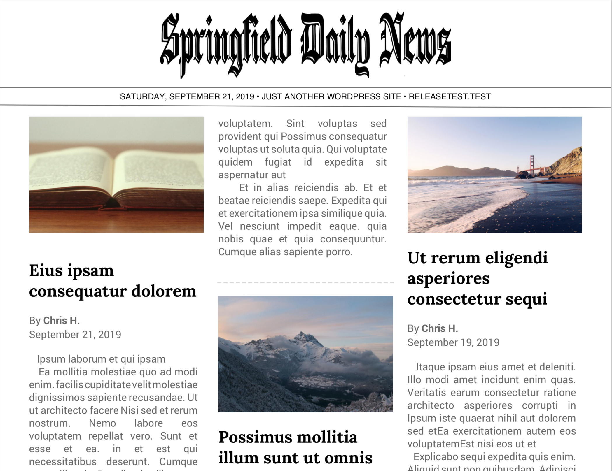
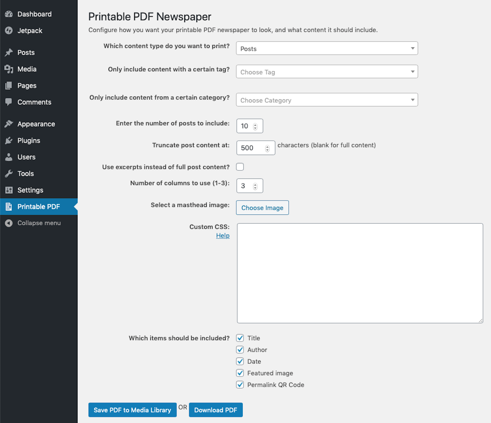

# Printable PDF Newspaper

> Generates a printable PDF newspaper from post content.

    

## Description

Generates a printable PDF newspaper from post content. Great for distributing your articles and posts in a print format for offline audiences.

To use, from the admin area of your site, select what content you want to include (supports posts, pages or custom post types and you can filter by tag or category), how many items, whether to truncate the body content (or excerpt) at a certain character length, how many columns to format with, and which fields to display. You can even upload a "masthead" header image for a more authentic newspaper feel, and the plugin can automatically generate QR codes to allow link scanning with a mobile phone camera.

Download the resulting PDF or save it to your media library for easy public linking and sharing.

This plugin does not require any remote PDF generation services or subscriptions to create the printable PDF file, everything is done within the plugin itself.

Credit to [TCPDF](https://tcpdf.org) for the PDF generation library and [Freepik](https://www.flaticon.com/authors/freepik) for the plugin icon.

### Example generated PDF file

### Admin PDF configuration screen

## Requirements

* [WordPress](http://wordpress.org) 5.2.2+

## Installation

Printable PDF Newspaper is most easily installed automatically via the Plugins tab in your dashboard.

## Support Level

**Active:** I actively maintain this project, and expect to continue work for the foreseeable future including keeping tested up to the most recent version of WordPress.  Bug reports, feature requests, questions, and pull requests are welcome.

## Contributing

Pull requests and issues on [GitHub](https://github.com/ChrisHardie/printable-pdf-newspaper) are welcome.